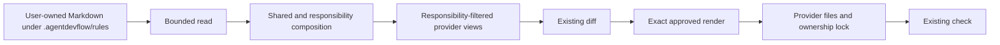

# Instruction composition

## Status

This document defines the current canonical-guidance and rule-management
slice. Filenames, diagnostics, and JSON fields remain beta surfaces until a
qualified release.

## Purpose

Projects need one editable source for their own rules while Codex, Claude Code,
and Cursor receive provider-native targets with procedure and rule sections
filtered by configured responsibility.

Provider outputs are projections. They are not another source of truth.

## Canonical inputs

Rules are immediate Markdown files under four fixed scope directories:

| Path pattern | Applies to |
| --- | --- |
| `.agentdevflow/rules/shared/<rule-id>.md` | Every configured provider product |
| `.agentdevflow/rules/steward/<rule-id>.md` | A provider assigned Steward |
| `.agentdevflow/rules/developer/<rule-id>.md` | A provider assigned Developer |
| `.agentdevflow/rules/reviewer/<rule-id>.md` | A provider assigned Reviewer |

Rule ids are lowercase ASCII slugs matching
`[a-z0-9]+(?:-[a-z0-9]+)*`, contain at most 64 characters, exclude Windows
reserved basenames, and are globally unique across scopes. There is no index
file, ordering metadata, provider-instance source, or nested discovery. Each
recognized file is bounded to 65,536 bytes and read through the same
repository-root and regular-file boundary used by the planner. Rules are
sorted by id within their scope.

The user owns these source files. A user may edit them directly, use the
bounded `rule` commands, or explicitly direct a coding agent to operate those
commands.

The former aggregate paths
`.agentdevflow/rules/{shared,steward,developer,reviewer}.md` were never
published. Their presence blocks every planning and rule command with exact
manual-move guidance. There is no public migration command, automatic move,
dual reader, journal, backup, or Git operation.

## Composition

Every generated provider view contains:

1. an explicit target coding-agent product and configured provider id;
2. a whole-projection applicability rule for matching and nonmatching runtimes;
3. shared workflow facts, stop conditions, and optional shared user guidance;
4. only the responsibility procedures and user rules assigned to that provider
   id; and
5. capability targets and stop conditions for the assigned responsibilities.

Different configured assignments can therefore produce byte-different views. A
Cursor target assigned Developer omits Steward and Reviewer procedure and rule
sections, while a Claude Code target assigned Reviewer omits Steward and
Developer sections.

When one provider id holds several responsibilities, its target contains every
assigned responsibility as a separately labelled section and instructs the
agent to select exactly one section for the current task. All of those sections
remain visible to the same provider target. Section labels do not select or
isolate an execution context, identity, permission set, or authority.

Native discovery surfaces can overlap. Current
[Cursor CLI documentation](https://cursor.com/docs/cli/using) describes project
context that includes root instruction files and Cursor rules, and a bounded
local observation reproduced simultaneous visibility of `AGENTS.md`,
`CLAUDE.md`, and `.cursor/rules/agentdevflow.mdc`. Each generated projection
therefore makes all its contents inapplicable when its declared product does
not match the current runtime. This is an advisory disambiguation rule, not
mechanical isolation or a compatibility guarantee.

Codex, Claude Code, and Cursor each have one project-wide native output path.
Two ids for the same product are rejected because one target cannot represent
them separately. One id may still hold multiple roles.

## Ownership and update flow

| Artifact | Owner | Mutation path |
| --- | --- | --- |
| Canonical guidance | User | Normal project edit or `rule` command |
| `AGENTS.md` | agentdevflow | Exact-approved `render` |
| `CLAUDE.md` | agentdevflow | Exact-approved `render` |
| `.cursor/rules/agentdevflow.mdc` | agentdevflow | Exact-approved `render` |
| `.agentdevflow/lock.json` | agentdevflow | Published last by `render` |

Canonical bytes and their paths contribute to the planned provider content and
plan digest. Editing guidance after `diff` makes the approval stale. Editing a
generated target directly creates ownership drift. No generated content is
reverse-synchronized into the canonical source.

Existing provider files use the renderer's ordinary create, exact-adopt,
supported equivalent-content import, explicit onboarding whole-file
replacement, or abort behavior. Replacement remains a planner input to the
same diff, render, and lock path; instruction composition adds no second
writer, approval mechanism, or source store.

## Failure behavior

Planning stops with a bounded diagnostic when:

- a recognized guidance path cannot be read safely;
- a configured provider product has more than one id;
- an existing provider target cannot be adopted or imported without
  information loss;
- a managed output or lock has drifted;
- the reviewed plan no longer matches current source and target bytes.

The planner does not disclose or overwrite unsupported foreign content.

## Deliberate absences

The accepted slice does not provide:

- a rule index, rule-level provenance format, or public rule DSL;
- provider-instance-specific or nested guidance;
- a composite source/provider transaction;
- a second digest, approval store, authorization ledger, backup, journal,
  lease, or Git manager;
- natural-language merge, semantic deduplication, or agent-assisted
  classification;
- automatic import of arbitrary existing provider instructions.

These absences are intentional boundaries. Manual existing-project onboarding
is built on this rule surface through exact whole-file inventory and
replacement disposition. Optional operation by one user-selected external
coding-agent CLI remains a later roadmap item.

Rule commands mutate only canonical rule files. A later external-agent
onboarding path may propose rule organization and operate the exact current
`agentdevflow` executable, including rule, diff, render, and check commands.
Provider outputs and the ownership lock remain under the existing render
command.

Unreleased aggregate inputs are never silently ignored or deleted; they block
with manual remediation. The later external-agent proposal mode stops before
mutation, while apply mode requires explicit one-operation delegation by the
user.

The accepted outcome does not revive the removed index, per-rule authorization
ledger, source/provider composite transaction, second approval model, managed
regions, backup system, semantic merge authority, or Git manager. See
`ROADMAP.md` for sequence and acceptance criteria.

## Qualification requirements

The slice is ready for a release candidate only when installed-package tests
prove:

- absent guidance still produces responsibility-filtered provider views;
- every installed output declares its exact target product and provider id,
  and makes the entire projection inapplicable to nonmatching products;
- composition includes shared and responsibility rules only in target bytes
  whose provider id has the corresponding scope;
- source edits produce a deterministic new diff and stale the old approval;
- exact-approved render converges to clean `check` and clean repeated `diff`;
- direct generated-file edits remain blocked drift;
- unreadable or oversized sources fail without mutation;
- ambiguous same-product ids fail clearly;
- the package includes the guidance reader and no obsolete experiment tree.
