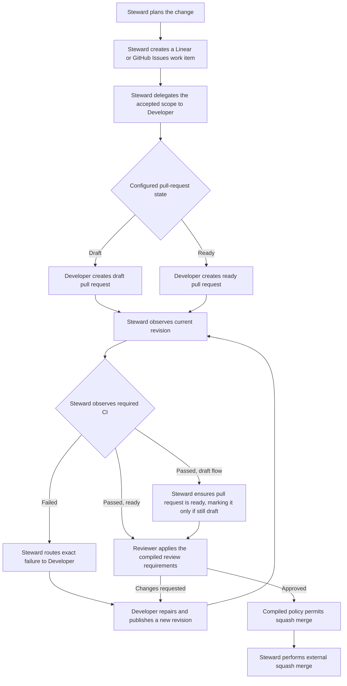

# Issue-to-reviewed-pull-request workflow

## Status

The current unreleased CLI can select this built-in workflow through
`init`. Its configuration remains a beta surface; the finite-state definition
and arbitrary workflow topology remain private.

The workflow compiles an operational procedure and responsibility-filtered
project instruction sections. It is not a tracker client, pull-request client,
CI monitor, agent scheduler, or merge service.

## User-visible choices

The CLI requires:

| Choice | Current values |
| --- | --- |
| Tracker | `linear` or `github-issues` |
| Pull-request initial state | `draft` or `ready` |
| Pull-request host | One project-local external id |
| CI system | One project-local external id |
| Merge method | Fixed to `squash` |
| Providers | Codex, Claude Code, or Cursor role bindings |

The host and CI ids name integrations in generated instructions. They do not
select an SDK, configure credentials, prove access, or perform discovery.

## Operational flow



Cycles are intentional. A repair changes the revision and invalidates stale CI,
review, and merge-authorization artifacts. Safety does not require a fixed
retry count.

### Steward

The generated Steward procedure:

1. prepares an explicit plan and creates the selected tracker work item;
2. delegates the accepted plan and work-item identity to the configured
   Developer;
3. observes the pull-request identity, current revision, and required CI;
4. routes exact failed CI evidence back to the Developer;
5. for a draft-configured flow, ensures the pull request is ready after CI
   passes and marks it ready only when it is still a draft; a ready-configured
   flow proceeds without this step;
6. starts the configured Reviewer under the selected preset's compiled review
   requirements;
7. performs squash merge only when current-revision CI and the review verdict
   satisfy policy; Balanced additionally requires a valid
   `ReviewerIsolationEvidence` artifact and no valid `BlockingFinding` artifact.

### Developer

The generated Developer procedure:

1. implements only the delegated plan and work-item scope;
2. creates the configured draft or ready pull request;
3. reports the pull-request identity and revision to the Steward;
4. repairs CI or review findings, verifies the repair, and publishes the new
   revision;
5. never approves, authorizes, or merges its own work.

### Reviewer

The generated Reviewer procedure always:

1. reviews the current revision and its current CI evidence;
2. reports actionable findings or an approval verdict without
   implementing the repair itself;
3. treats the verdict as stale after every repair or revision change.

Balanced additionally requires a valid `ReviewerIsolationEvidence` artifact and
no valid `BlockingFinding` artifact at acceptance. Generated procedures tell
the Reviewer to begin from a declared clean execution context distinct from
implementation. Fast requires a current review verdict without those additional
artifact gates. A different provider product does not prove reviewer identity
or isolation, and the CLI does not acquire or authenticate the declared
context.

## Capability semantics

The internal definition currently uses these capability names:

| Binding | Capability |
| --- | --- |
| Tracker | `tracker.work-item.create` |
| Developer | `development.task.delegate` |
| Pull-request host | `pull-request.create` |
| Pull-request host for draft mode | `pull-request.mark-ready` |
| CI | `ci.result.observe` |
| Reviewer | `review.independent.run` |
| Pull-request host | `pull-request.merge` |

Every current issue-workflow capability is represented as:

```text
mechanism: compiled-procedure
```

This means the compiler can produce coherent instructions, not that
`agentdevflow` has acquired an external adapter. The CLI performs no network
access, credential lookup, API mutation, polling, retry, or provider
invocation.

Generated instructions require the active agent to stop and report the exact
missing tool, integration, permission, or capability. They forbid silently
switching trackers, substituting a weaker mechanism, skipping a gate, or
simulating success.

## Policy model

The private finite-state compiler models:

- static nodes and transitions, including cycles;
- typed artifact production and invalidation;
- current-revision CI and review requirements;
- Balanced `ReviewerIsolationEvidence` and no-valid-`BlockingFinding`
  requirements;
- merge authorization and squash-merge completion;
- deterministic counterexample traces for unsafe paths.

Guards are treated as potentially enabled, so guard-related diagnostics are
an explicit over-approximation. The compiler does not schedule work or validate
arbitrary executable predicates.

Artifact validity is an internal safety abstraction, not a versioned evidence
payload or proof of external truth. The current product instructs participants
to use the current revision and invalidate stale CI and review results; it does
not receive or authenticate observations from Linear, GitHub, CI, or coding
agents.

## Provider neutrality

Steward, Developer, and Reviewer are workflow responsibilities. Codex, Claude
Code, and Cursor are bindings used to render native project instructions. A
provider change normally changes role bindings and generated views, not the
workflow topology.

The same Codex provider id may be assigned both Steward and Reviewer. Its
generated `AGENTS.md` then contains both responsibility sections, and separate
invocations may be instructed to follow different sections. The file itself
does not isolate the invocations, identities, permissions, or authority. Two
distinct Codex ids are not currently supported because both would map to the
same project-wide `AGENTS.md`.

## Product boundary

The current slice deliberately excludes:

- automatic tracker or pull-request mutation;
- live CI observation;
- agent process delegation or monitoring;
- auxiliary review configuration or execution;
- automatic merge;
- credentials, webhooks, queues, polling, retries, and persistent runtime
  state;
- a public workflow DSL.

Those exclusions keep `agentdevflow` useful as a configurator and policy
compiler without turning it into an orchestration platform. A live adapter
should be added only after one concrete user outcome proves that generated
procedures are insufficient and the adapter's credentials, failure model, and
ownership boundary are accepted.
