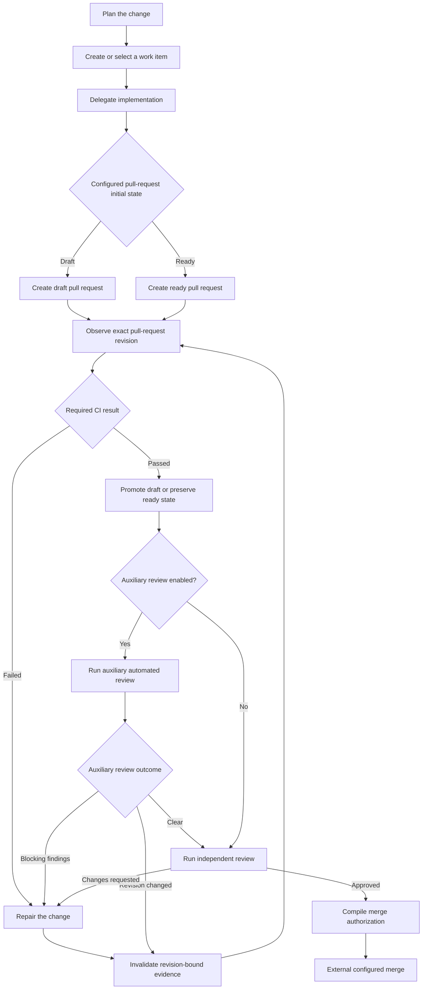

# Issue-to-reviewed-pull-request workflow candidate

## Status

This workflow family is an approved domain-validation direction. Its names, configuration shape, evidence transport, and capability contracts remain private candidates rather than public API.

The purpose of this document is to preserve the minimum durable model needed to validate a realistic development flow without turning `agentdevflow` into an orchestration runtime or publishing a general workflow DSL.

The first executable private definition and a local no-pull-request contrast workflow now pass the domain-validation slice. See [private domain workflow evidence](../evidence/private-domain-workflows.md). This result validates the internal boundary but does not freeze the candidate representation.

## Product boundary

`agentdevflow` should configure, compile, and validate the workflow. It may export deterministic procedures, provider artifacts, capability requirements, evidence requirements, and an execution manifest.

External agents and systems remain responsible for long-running execution, credentials, API mutation, retries, rate limits, scheduling, pull-request monitoring, and merge operations. The compiler must describe the actual enforcement strength and must not present an instruction or imported observation as mechanical enforcement.

## Candidate flow

The workflow supports either a draft pull request or a pull request that is ready for review immediately. Pull-request readiness is a hosting-surface state; it is not proof that merge policy has been satisfied.

Cycles are intentional. A repair cycle must not require a configured retry bound for safety validation. Operational retry and escalation policy belongs to an executor, not the finite-state safety core.

## Stable modeling dimensions

The experiment should keep seven concerns separate:

1. **Responsibilities**: Steward, Developer, and Reviewer remain provider-neutral roles.
2. **Procedures**: planning, work-item creation, delegation, pull-request observation, CI repair, review, findings reconciliation, and merge preparation.
3. **Capabilities**: versioned external actions or observations with explicit authorization, side effects, failure behavior, and provenance.
4. **Evidence**: typed, revision-bound records used by policy checks.
5. **Policies**: closed safety requirements that decide whether a transition is authorized.
6. **Bindings**: provider, surface, version, execution context, principal, and supported capabilities.
7. **Enforcement**: the actual mechanism, scope, bypass authority, availability, and required strength.

A provider replacement should normally change bindings, not workflow topology. An optional automated reviewer should normally enable or disable one bounded stage, not create a provider-specific workflow.

## Candidate procedures

The private workflow definition should initially compose a closed set of procedures:

- `plan-task`;
- `create-work-item`;
- `delegate-implementation`;
- `observe-pull-request`;
- `verify-ci`;
- `repair-change`;
- `prepare-pull-request-review`;
- `run-auxiliary-review`;
- `review-change`;
- `reconcile-findings`;
- `authorize-merge`;
- `record-progress`.

These names are experimental. The first implementation should use one internal workflow definition rather than expose arbitrary procedure composition.

## Candidate capabilities

Provider and tracker adapters may satisfy capabilities such as:

- `tracker.work-item.create`;
- `tracker.work-item.observe`;
- `development.task.delegate`;
- `pull-request.create`;
- `pull-request.observe`;
- `pull-request.mark-ready`;
- `ci.result.observe`;
- `review.auxiliary.run`;
- `review.independent.run`;
- `pull-request.merge`.

Capability identifiers and versions are not yet public. A capability contract must state whether it observes or mutates external state, which authorization it needs, whether it supports a dry run, what evidence it returns, and how partial or ambiguous failure is reported.

Linear, GitHub, Codex, Claude Code, and Cursor are adapter targets or execution bindings, not workflow primitives. The compiler must diagnose an unavailable capability rather than silently substitute a weaker operation.

## Typed evidence and invalidation

The initial experiment should consider these private artifact candidates:

| Artifact | Minimum binding |
| --- | --- |
| `Plan` | Workflow and plan digest |
| `WorkItemRef` | Tracker kind and immutable item identity |
| `DelegationReceipt` | Work item, Developer binding, and delegated plan digest |
| `PullRequestSnapshot` | Pull-request identity, exact revision, and draft or ready state |
| `CiResult` | Exact revision, required check set, and result |
| `AuxiliaryReviewResult` | Exact revision, reviewer binding, findings, and whether mutation occurred |
| `ReviewVerdict` | Exact revision, Reviewer binding, independence evidence, findings, and verdict |
| `MergeAuthorization` | Exact revision and the complete policy-evidence digest set |
| `MergeReceipt` | Pull-request identity, merged revision, method, and external result |

At minimum, a change to the pull-request revision invalidates `CiResult`, `AuxiliaryReviewResult`, `ReviewVerdict`, and `MergeAuthorization`. A review or autofix step that changes bytes must return to revision observation and CI validation. A draft-to-ready state change updates the pull-request snapshot but does not by itself prove or invalidate revision-bound CI results.

Changing the locked workflow, required checks, reviewer-independence policy, or merge policy invalidates an earlier `MergeAuthorization`. Closing, replacing, or retargeting a pull request must fail closed when the compiler cannot prove that existing evidence still applies.

Artifact structure and digest consistency do not prove semantic truth. Evidence imported from a human or external runner must retain its provenance and enforcement limitations.

## Reviewer independence

A different provider name is insufficient evidence of an independent review. The candidate policy should be able to require constraints on:

- principal separation between Developer and Reviewer;
- a fresh execution context or session;
- permitted inherited state;
- credentials or authority separation where relevant;
- an exact reviewed revision.

The first experiment should model these facts as explicit observations and validate their consistency. It must not claim authenticated identity or isolation that the producing system cannot attest.

## Pull-request initial state

The initial state should be an explicit private configuration choice with two closed values:

- `draft`: create a draft pull request and mark it ready after required CI succeeds;
- `ready`: create a pull request that is ready for review and preserve that state while required gates run.

The compiler should not assume that every project uses draft pull requests. No public default should be selected until preset behavior, provider support, and migration expectations have evidence. Both modes converge on the same revision-bound CI, review, and merge policies. The first candidate promotes a draft after CI succeeds; later evidence may justify a separate bounded promotion-policy choice.

## Execution export

The recommended boundary is a deterministic execution manifest plus versioned evidence envelopes. An external Steward, agent, CI job, or future runner may consume the manifest and return evidence. The compiler then revalidates the current revision and artifacts before authorizing the next transition.

The first private implementation now exports both this workflow family and the local no-pull-request contrast through one [private execution contract](private-execution-contract.md). The contract verifies supplied traces but does not choose or execute them.

The core should not acquire an always-running monitor, credential vault, retry scheduler, or provider session manager. If end-to-end autonomous execution later proves valuable, it should begin as a separately bounded runner with explicit security, persistence, and recovery contracts.

A manual binding remains valid when automation is unavailable: the generated procedure may ask an operator or agent to perform an action and supply evidence. Such a binding is advisory or observed, not mechanically enforced, unless an external control proves otherwise.

## Representative variations

The same workflow definition should cover at least these variations through configuration and bindings:

| Variation | Expected representation |
| --- | --- |
| Different Steward provider | Replace the Steward binding |
| Cursor or another Developer | Replace the Developer binding and delegation capability |
| Draft pull request | Select `draft` initial state |
| Immediately ready pull request | Select `ready` initial state |
| Auxiliary automated review enabled | Enable the bounded auxiliary-review stage and bind its capability |
| Auxiliary automated review disabled | Omit that stage without weakening required independent review |
| Tracker-backed work | Bind GitHub Issues or Linear capabilities |
| Local work | Bind local evidence procedures without a tracker runtime |
| Squash merge | Select squash as the configured external merge method after authorization |

## Open decisions and recommendations

| Question | Recommendation | Evidence required before acceptance |
| --- | --- | --- |
| Public workflow representation | Keep the workflow definition private and expose only bounded project choices first | At least two materially different realistic workflows compile without provider-specific topology |
| Pull-request initial-state default | Do not select a public default; require explicit private specimens and let future presets choose documented defaults | Provider qualification and migration fixtures for both modes |
| Draft promotion timing | Use required CI success for the first candidate; separate it from initial state only when another real workflow requires different timing | A realistic workflow that promotes a draft before or after a different closed gate |
| Auxiliary review cardinality | Start with zero or one optional stage; generalize to an ordered bounded list only when a second real case requires it | Multiple reviewer-stage fixtures with deterministic invalidation semantics |
| CI and review ordering | Start with CI before review, but keep their evidence requirements independent so a later workflow may permit concurrent collection | A realistic concurrent-review fixture and deterministic evidence-state budget |
| Execution protocol | Export a deterministic manifest and typed evidence; do not add a scheduler to the core | End-to-end fixture driven by a replaceable external executor |
| Evidence transport | Retain repository files as the leading local-first candidate | Discovery, ownership, confidentiality, and concurrent-update evidence |
| Tracker mutation | Separate proposal from approved mutation and keep credentials outside the compiler model | Linear and GitHub fixtures covering authorization and ambiguous failures |
| Merge execution | Keep merge external and compile only exact-revision authorization | Hosted protection evidence and stale-authorization rejection |
| Merge method | Keep the method explicit and capability-checked; use squash in the first fixture without making it universal | Provider support and policy fixtures for each additional method |
| Reviewer isolation | Model explicit execution-context and principal observations | Provider-specific evidence showing which isolation facts are observable or attestable |

## Validation slice

Before freezing a public parser, schema, filename, or arbitrary workflow API, implement one private `IssueToReviewedPullRequest` definition and deterministic fixtures for:

1. a draft pull request that becomes ready after CI passes;
2. a pull request created ready that remains blocked from merge until gates pass;
3. CI failure followed by an unbounded repair cycle;
4. a new revision that invalidates an earlier successful CI result;
5. an auxiliary-review autofix that invalidates CI and review evidence;
6. auxiliary blocking findings without mutation that route to repair;
7. an independent-review requirement that rejects the Developer execution context;
8. a stale review verdict after rework;
9. a direct merge bypass;
10. an auxiliary-review-disabled flow that remains safe through independent review;
11. an unavailable or advisory-only capability that cannot satisfy a stronger policy;
12. a local reviewed-change workflow that compiles without tracker, pull-request, CI, or merge concepts.

The slice passes when the same private definition covers the listed variations through bounded configuration, diagnostics and counterexample traces remain deterministic, and provider-specific fields do not enter workflow topology. It fails if realistic variation requires arbitrary executable predicates, a runtime scheduler, or provider-specific branches throughout the compiler.
